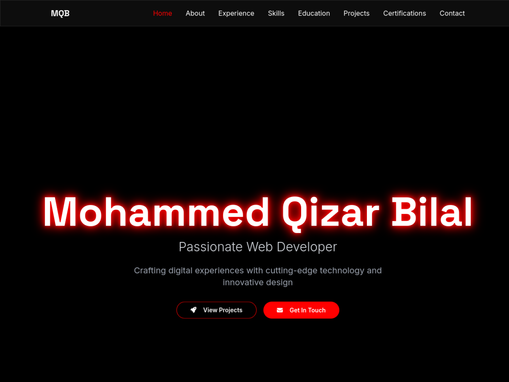
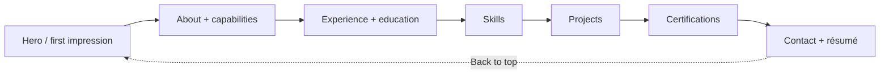

<div align="center">

# MQB / PORTFOLIO

### A single-page developer story in black, white, and signal red

[](https://qizar-bilal.netlify.app)
[](package.json)
[](vite.config.ts)
[](tsconfig.json)
[](LICENSE)

</div>



<p align="center"><sub>Genuine UI capture from the public Netlify deployment · captured August 2026</sub></p>

## Opening frame

This repository powers Mohammed Qizar Bilal’s long-form developer portfolio: a responsive, animated, single-page presentation of profile, experience, technical skills, education, selected work, certifications, contact paths, and downloadable résumé.

The design makes one strong visual commitment—deep black surfaces with focused red signals—then carries it through navigation, calls to action, timelines, project cards, and interaction feedback.

## The page, cut by cut

| Chapter | Purpose | Interaction |
|---|---|---|
| `HOME` | Name, role, and immediate direction | Project and contact calls to action |
| `ABOUT` | Short professional introduction | Four-capability snapshot |
| `EXPERIENCE` | AI/ML and Python internship timeline | Scannable responsibility cards |
| `SKILLS` | Frontend, backend, data, design, and tools | Icon-led technology matrix |
| `EDUCATION` | Degree and higher-secondary milestones | Chronological timeline |
| `PROJECTS` | Selected products and source/demo links | External GitHub and live routes |
| `CERTIFICATIONS` | Credential collection | Visual certificate presentation |
| `CONTACT` | Collaboration entry point | Validated message form and social links |

## Narrative engine



## Build anatomy

```text
index.html
   └─ src/main.tsx
       └─ App.tsx
           ├─ QueryClientProvider
           ├─ TooltipProvider
           ├─ ScrollIndicator
           ├─ Portfolio.tsx        main single-page composition
           ├─ BackToTop
           └─ Toaster

src/assets/
   ├─ profile.jpg
   ├─ project artwork
   └─ certificates/

public/resume.pdf
```

The repository includes a broad component library, while the live portfolio itself is primarily composed in `src/components/Portfolio.tsx` with shared toast, tooltip, scroll-progress, and back-to-top behavior.

## Run the reel locally

```bash
git clone https://github.com/QizarBilal/Personal-Portfolio.git
cd Personal-Portfolio
npm install
npm run dev
```

Vite prints the local URL, normally `http://localhost:5173`.

Production check:

```bash
npm run build
npm run preview
```

The generated static site is written to `dist/` and can be served by Netlify or another static host.

## Design tokens

- **Canvas:** black and near-black layers for depth without visual noise.
- **Signal:** saturated red for active navigation, glow, and primary actions.
- **Type:** high-contrast white/gray hierarchy for quick scanning.
- **Motion:** Framer Motion and CSS transitions support section arrival and feedback.
- **Navigation:** one-page anchors preserve context and reduce route overhead.
- **Responsive behavior:** stacked content and adaptable controls support smaller screens.

## Content maintenance checklist

When updating the portfolio:

1. Verify every project’s GitHub and live-demo link.
2. Keep experience and education dates consistent across the site and résumé.
3. Optimize new profile/certificate images before committing them.
4. Add meaningful alt text and keyboard-accessible interactions.
5. Test the contact form’s configured destination and error state.
6. Run `npm run build` and inspect desktop and mobile breakpoints.
7. Capture a new genuine README view when the hero design materially changes.

## Deployment

The current public build is available at **[qizar-bilal.netlify.app](https://qizar-bilal.netlify.app)**.

For Netlify, use:

| Setting | Value |
|---|---|
| Build command | `npm run build` |
| Publish directory | `dist` |

## License

The portfolio source is released under the [MIT License](LICENSE). Personal photographs, résumé content, certificates, names, and third-party brand assets may carry separate personal or third-party rights.

<div align="center">

**Read the story. Inspect the work. Start a conversation.**

[Live portfolio](https://qizar-bilal.netlify.app) · [LinkedIn](https://linkedin.com/in/mohammed-qizar-bilal) · [GitHub](https://github.com/QizarBilal)

</div>
